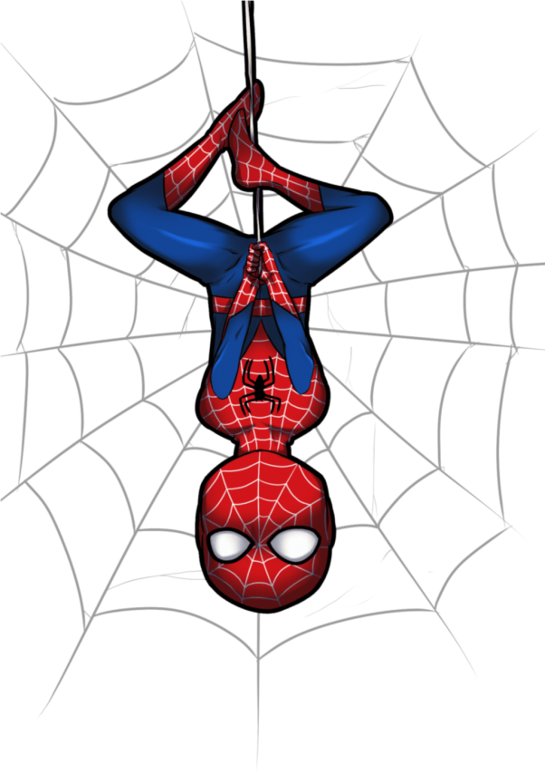

  

    
04 / Move

    
Strength is built in the return.

    
Training logs, progressive overload, nutrition, recovery, and the small choices that make showing up tomorrow easier.

    
trainingfoodrecovery

  

  

> [!tip] Field rule
> The heroic part is rarely the perfect workout. It is returning for the next one.

## What lives here

- Programs and workout logs
- Exercise cues and progress
- Nutrition experiments
- Sleep, mobility, and recovery
