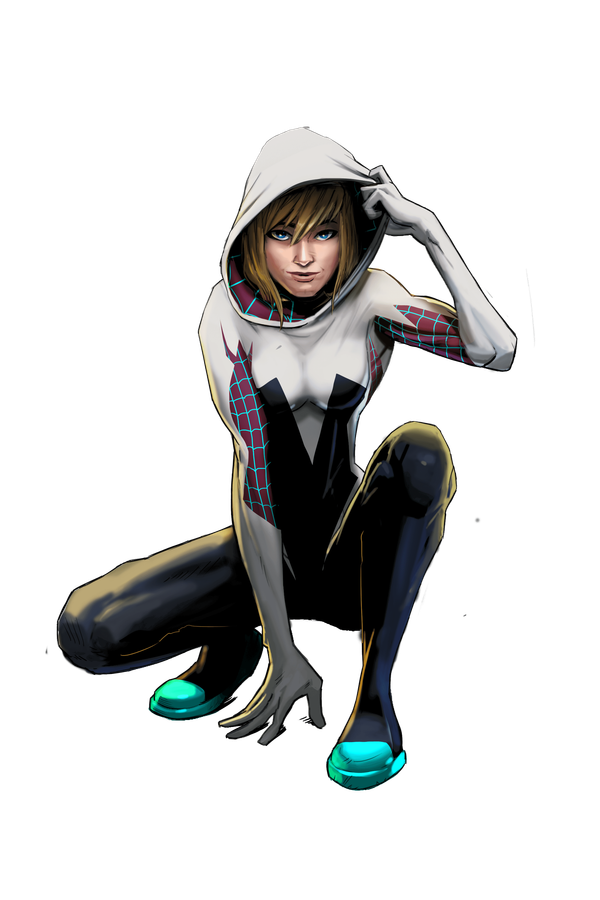

  

    
05 / Inner world

    
Make room for the quieter questions.

    
Psychology, philosophy, habits, reflection, and the slow work of understanding how I think, choose, and grow.

    
reflectionhabitsmeaning

  

  

> [!tip] Field rule
> I do not need to have it figured out before I write honestly about it.

## What lives here

- Journaled lessons and decisions
- Mental models for everyday life
- Psychology and philosophy notes
- Habits, attention, and emotional fitness
