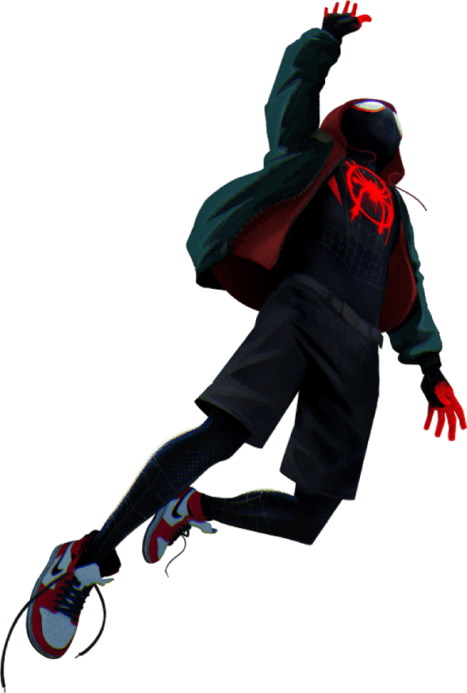

  <section class="home-hero" aria-labelledby="home-title">
    

      
 Earth-2308 / Personal archive

      <h1 id="home-title">A life in <em>progress.</em></h1>
      
Notes on the work, the body, the mind, and everything I am still learning to carry.

      

        <a class="hero-action hero-action--primary internal" href="./daily/">Open the daily log ↗</a>
        <a class="hero-action hero-action--quiet internal" href="#the-web">Browse the web ↓</a>
      

    

    

      KEEP GOING
      
    

  </section>

  

    Current canon
    Learn in public
    Train with intent
    Write it down
  

  <section class="web-section" id="the-web" aria-labelledby="web-title">
    <header class="section-heading">
      

        
Nine threads. One life.

        <h2 id="web-title">Choose a thread.</h2>
      

      
Every note belongs somewhere. Every path eventually connects.

    </header>
    

      <a class="universe-card universe-card--daily universe-card--wide internal" href="./daily/">
        
        00 / Field log
        Daily notes
        
The ordinary days, captured before they disappear.

        ↗
      </a>
      <a class="universe-card universe-card--blue internal" href="./ai-and-ml/">
        
        01 / Intelligence
        AI &amp; ML
        
Models, papers, experiments, and useful failures.

        ↗
      </a>
      <a class="universe-card universe-card--red internal" href="./software-engineering/">
        
        02 / Build
        Software engineering
        
Code, tools, patterns, and lessons from the bugs.

        ↗
      </a>
      <a class="universe-card universe-card--ink internal" href="./system-design-and-lld/">
        
        03 / Systems
        System design
        
Architecture, scale, trade-offs, and clean boundaries.

        ↗
      </a>
      <a class="universe-card universe-card--yellow internal" href="./fitness/">
        
        04 / Move
        Fitness
        
Training, nutrition, recovery, and showing up again.

        ↗
      </a>
      <a class="universe-card universe-card--blue internal" href="./mind-and-life/">
        
        05 / Inner world
        Mind &amp; life
        
Habits, philosophy, reflection, and becoming steadier.

        ↗
      </a>
      <a class="universe-card universe-card--red internal" href="./career-and-money/">
        
        06 / Momentum
        Career &amp; money
        
Work, interviews, leverage, and building a future.

        ↗
      </a>
      <a class="universe-card universe-card--ink internal" href="./english/">
        
        07 / Language
        English
        
Words, grammar, expression, and clearer thinking.

        ↗
      </a>
      <a class="universe-card universe-card--yellow internal" href="./general-concepts/">
        
        08 / Crossovers
        General concepts
        
Mental models and ideas that refuse one category.

        ↗
      </a>
    

  </section>

  
● This archive is alive. Expect unfinished thoughts, new connections, and the occasional dimensional glitch.

